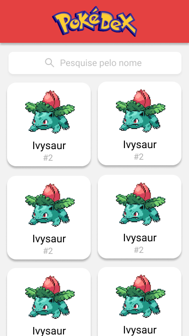
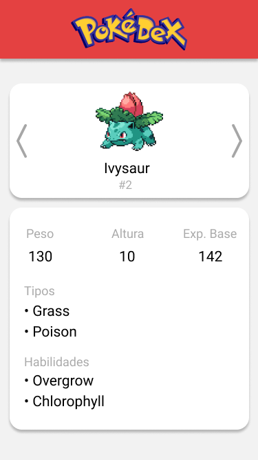

  

# Pokédex

## About

    The Pokédex is a digital encyclopedia created by Professor Oak as an invaluable tool to Trainers in the Pokémon world. This project was developed throughout the Bootcamp of "Respode Aí" as a web application that lists all Pokemons and their descriptions.

    <a href="#features">Features</a> • 
    <a href="#tech">Tech Stack</a> •
    <a href="#layout">Layout</a> • 
    <a href="#contributors">Contributors</a> • 
    <a href="#author">Author</a>

### Features
- [x] List of pokemons 
- [x] Viewing the description of the chosen pokemon 
- [x] Pokemon search tool 
- [x] Navigation buttons between description of pokemon

### Tech Stack
Languages: 

    
    
    
    

The following tools were used in the construction of the project:

- [React](https://pt-br.reactjs.org/) 
- [React-Router](https://reactrouter.com/) 
- [Webpack](https://webpack.js.org/) 
- [Node.js](https://nodejs.org/en/) 
- [Axios](https://github.com/axios/axios) 
- [Font Awesome](https://fontawesome.com/) 
- [Babel](https://babeljs.io/) 

# Layout Mobile

The application layout is available on Netlify:

### Contributors
<a href="https://www.respondeai.com.br/">

 
<b>Responde Aí</b>
</a>

### Author
---

 
Made by 👋🏽 Get in Touch!  
 

